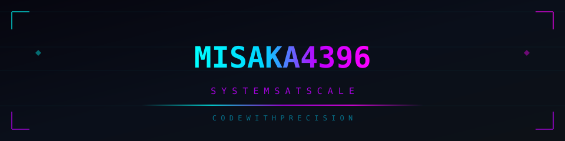

<!-- ===== CUSTOM BANNER ===== -->

 
 

<!-- ===== VISITOR COUNTER ===== -->

 
 

<!-- ===== RGB DIVIDER ===== -->

 

<!-- ===== LANGUAGES ===== -->
<h3>⚙️ LANGUAGES</h3>

&nbsp;

&nbsp;

&nbsp;

&nbsp;

 

<!-- ===== FRAMEWORKS & RUNTIME ===== -->
<h3>⚡ FRAMEWORKS &amp; RUNTIME</h3>

&nbsp;

&nbsp;

&nbsp;

 

<!-- ===== INFRASTRUCTURE & DEVOPS ===== -->
<h3>🛠 INFRASTRUCTURE &amp; DEVOPS</h3>

&nbsp;

&nbsp;

&nbsp;

&nbsp;

&nbsp;

 

<!-- ===== DATA & STORAGE ===== -->
<h3>💾 DATA &amp; STORAGE</h3>

&nbsp;

&nbsp;

 
 

<!-- ===== RGB DIVIDER ===== -->

 

<!-- ===== GITHUB STATS ===== -->
<h3>📊 GITHUB STATS</h3>

&nbsp;

 

 
 

<!-- ===== RGB DIVIDER ===== -->

 

<!-- ===== CUSTOM IMAGE PLACEHOLDER ===== -->
<h3>🖼 CUSTOM IMAGE</h3>

<!--
  替换为你的自定义图片:
  1. 把图片放到 assets/ 文件夹
  2. 把下面 src 改成你的图片文件名
  3. 取消注释即可
-->
<!--  -->

 
 

<!-- ===== DEPLOY STATUS ===== -->

&nbsp;

&nbsp;

